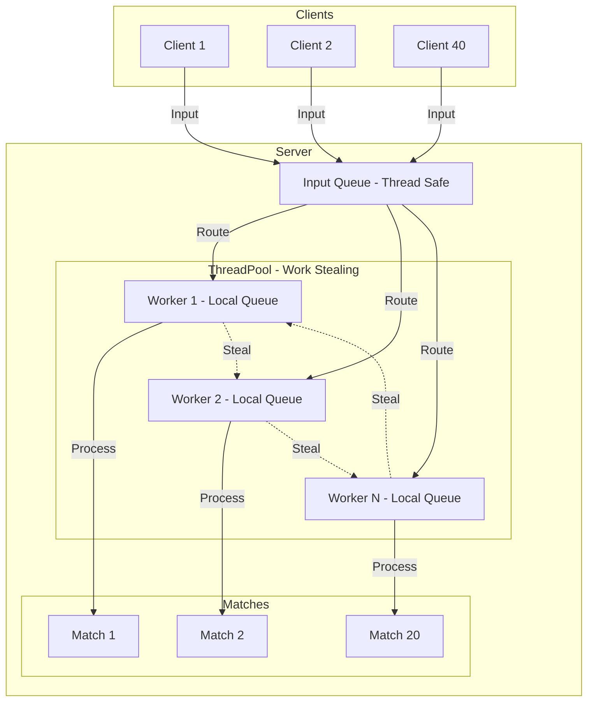
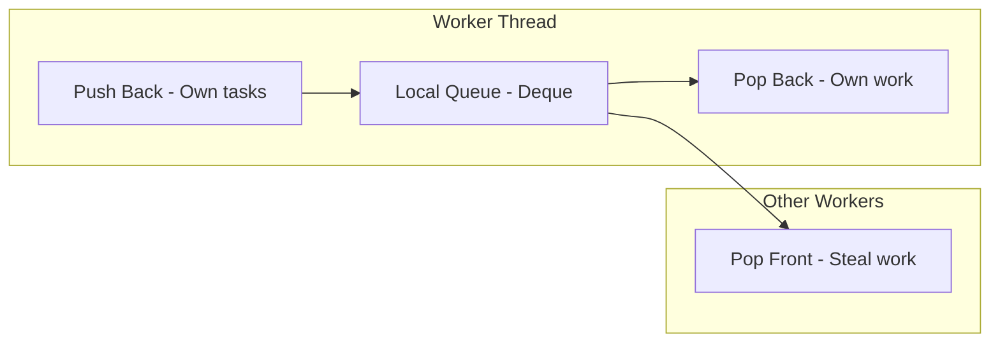
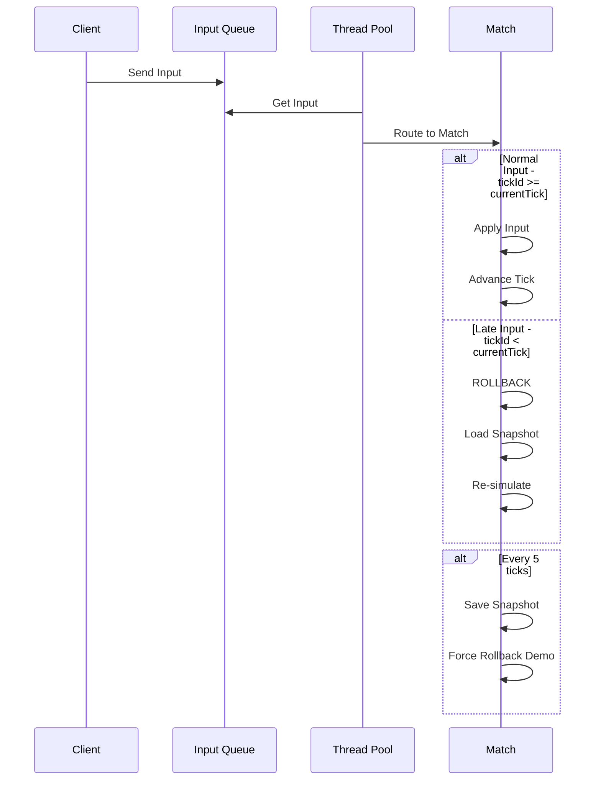

# Kế hoạch Implementation: Game Server với Work-Stealing Scheduler

## 1. Tổng quan hệ thống

### Yêu cầu chính:
- 20 match chạy song song
- 40 client (2 client/match)
- Mỗi client gửi 10,000 input → Tổng 400,000 input
- Work-stealing scheduler tự implement
- Rollback mỗi 5 tick
- **ĐƠN GIẢN HÓA:** Chỉ movement (MOVE_UP, DOWN, LEFT, RIGHT), không có combat

### Kiến trúc tổng thể



## 2. Cấu trúc file

```
para/
├── src/
│   ├── main.cpp                 # Entry point, benchmark
│   ├── common/
│   │   ├── types.hpp            # Enums, constants
│   │   └── data_structures.hpp  # Input, PlayerState, MatchState, Snapshot
│   ├── scheduler/
│   │   ├── work_stealing_queue.hpp  # Thread-safe deque
│   │   └── thread_pool.hpp          # Thread pool với work-stealing
│   ├── game/
│   │   ├── match.hpp            # Match class declaration
│   │   ├── match.cpp            # Match implementation
│   │   ├── game_server.hpp      # GameServer declaration
│   │   └── game_server.cpp      # GameServer implementation
│   └── client/
│       ├── client.hpp           # Client simulator declaration
│       └── client.cpp           # Client implementation
├── CMakeLists.txt               # Build configuration
└── spec.md                      # Specification
```

## 3. Data Structures

### 3.1 Enums và Constants

```cpp
// types.hpp
enum class ActionType {
    // Movement actions only - simplified
    MOVE_LEFT,
    MOVE_RIGHT,
    MOVE_UP,
    MOVE_DOWN
};

constexpr int ARENA_WIDTH = 20;
constexpr int ARENA_HEIGHT = 20;
constexpr int ROLLBACK_INTERVAL = 5;  // Rollback mỗi 5 tick

constexpr int NUM_MATCHES = 20;
constexpr int NUM_CLIENTS = 40;
constexpr int INPUTS_PER_CLIENT = 10000;
```

### 3.2 Core Structures

```cpp
// data_structures.hpp
struct Input {
    int matchId;
    int playerId;
    int tickId;
    ActionType type;  // MOVE_LEFT, MOVE_RIGHT, MOVE_UP, MOVE_DOWN
};

struct PlayerState {
    int id;
    int x = 10;  // Start center
    int y = 10;
};

struct MatchState {
    int matchId;
    int currentTick = 0;
    std::array<PlayerState, 2> players;
    bool isRunning = false;
};

struct Snapshot {
    int tickId;
    MatchState state;
};
```

## 4. Work-Stealing Scheduler

### 4.1 Work-Stealing Queue



**Đặc điểm:**
- Mỗi worker có 1 deque riêng
- Push/Pop từ **back** (LIFO) cho task của mình
- Steal từ **front** (FIFO) khi worker khác hết việc
- Dùng mutex để đảm bảo thread-safety

### 4.2 Thread Pool Architecture

```cpp
class ThreadPool {
    std::vector<std::thread> workers;
    std::vector<WorkStealingQueue<Task>> localQueues;
    std::atomic<bool> running;
    
    void workerFunction(int workerId) {
        while (running) {
            Task task;
            
            // 1. Try get from local queue
            if (localQueues[workerId].tryPopBack(task)) {
                task();
                continue;
            }
            
            // 2. Try steal from other workers
            for (int i = 0; i < workers.size(); i++) {
                if (i != workerId && localQueues[i].tryPopFront(task)) {
                    task();
                    break;
                }
            }
            
            // 3. No work found, yield
            std::this_thread::yield();
        }
    }
};
```

## 5. Game Logic Flow

### 5.1 Input Processing Flow



### 5.2 Rollback Mechanism

```cpp
class Match {
    MatchState currentState;
    std::vector<Snapshot> snapshots;
    std::vector<Input> inputHistory;
    std::mutex stateMutex;
    
    void rollback(int toTick) {
        std::lock_guard<std::mutex> lock(stateMutex);
        
        // 1. Find nearest snapshot
        auto it = std::lower_bound(snapshots.begin(), snapshots.end(), toTick,
            [](const Snapshot& s, int t) { return s.tickId < t; });
        
        if (it != snapshots.begin()) --it;
        
        // 2. Load snapshot
        currentState = it->state.clone();
        
        // 3. Re-simulate from snapshot to current
        for (const auto& input : inputHistory) {
            if (input.tickId >= it->tickId && input.tickId <= currentTick) {
                applyInput(input);
            }
        }
    }
};
```

## 6. Simplified Movement Logic

### Movement Rules:
- Player di chuyển 1 đơn vị mỗi input
- Không được ra khỏi arena 20x20
- Clamp position: x in [0, 19], y in [0, 19]

### Apply Input:
```cpp
void applyInput(const Input& input) {
    PlayerState& player = state.players[input.playerId % 2];
    switch (input.type) {
        case ActionType::MOVE_LEFT:  player.x = std::max(0, player.x - 1); break;
        case ActionType::MOVE_RIGHT: player.x = std::min(19, player.x + 1); break;
        case ActionType::MOVE_UP:    player.y = std::max(0, player.y - 1); break;
        case ActionType::MOVE_DOWN:  player.y = std::min(19, player.y + 1); break;
    }
}
```

## 7. Benchmark Strategy

### Sequential Mode
```cpp
void runSequential() {
    for (each input in allInputs) {
        routeToMatch(input);
        processMatch(input.matchId);
    }
}
```

### Parallel Mode
```cpp
void runParallel() {
    ThreadPool pool(std::thread::hardware_concurrency());
    
    // Submit all client send tasks
    for (each client) {
        pool.submit([&]{ client.sendAllInputs(); });
    }
    
    // Server processing tasks
    pool.submit([&]{ server.processAllInputs(); });
    
    pool.waitAll();
}
```

### Measurements
- Total execution time
- Average input latency
- Rollback count
- Work stealing count

## 8. Build & Run

```bash
# Build
mkdir build && cd build
cmake .. -DCMAKE_BUILD_TYPE=Release
cmake --build .

# Run
./game_server
```

## 9. Expected Output

```
=== Game Server Simulation ===
Matches: 20
Clients: 40
Inputs per client: 10000
Total inputs: 400000

--- Sequential Mode ---
Time: XXXX ms
Rollbacks: XXXX

--- Parallel Mode ---
Threads: X
Time: XXXX ms
Rollbacks: XXXX
Work steals: XXXX

Speedup: X.XXx
```

## 10. Implementation Order

1. **types.hpp** - ActionType enum, constants
2. **data_structures.hpp** - Input, PlayerState, MatchState, Snapshot
3. **work_stealing_queue.hpp** - Thread-safe deque
4. **thread_pool.hpp** - Thread pool với work-stealing
5. **match.hpp/cpp** - Match class với rollback
6. **game_server.hpp/cpp** - GameServer quản lý matches
7. **client.hpp/cpp** - Client simulator
8. **main.cpp** - Benchmark sequential vs parallel
9. **CMakeLists.txt** - Build configuration